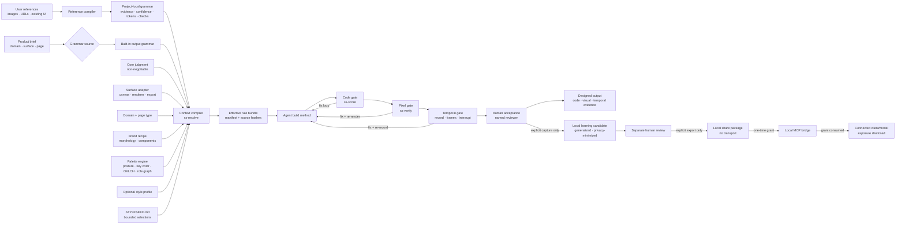

# StyleSeed Engine Architecture

StyleSeed converts product intent and visual evidence into an enforceable design method for
coding agents. The architecture separates **fixed judgment**, **task-specific grammar**, and
**project-specific choices** so consistency does not collapse into one universal aesthetic.


## System flow



## Artifact registry boundary

For registry projects, `.styleseed/project.json` contains project-wide design DNA and
`.styleseed/artifacts/index.json` names independent artifact contracts. Each artifact owns its target,
implementation roots, validation contract, compiled bundle, manifest, and evidence run. A skill first
resolves one artifact ID, verifies its manifest and actual output bytes, and reads only that artifact's
bundle. The legacy `.styleseed/effective-rules.md` and `.styleseed/manifest.json` pair is a compatibility
path for projects without a registry; it is never a fallback inside a registry project.

The machine-readable `engine/skill-contracts.json` matrix records which skills consume a bundle, may
select a grammar, may mutate project configuration, and which computed evidence level they may claim.
`scripts/validate-skill-contracts.mjs` checks that matrix against the canonical skills before generation.

Project instruction files are not silently rewritten. `scripts/write-managed-instructions.mjs` is dry-run
by default and writes only with explicit `--write`; it preserves text outside the managed markers and
refuses symlinks, hardlinks, malformed markers, and multiple managed blocks.

## Layers and authority

| Layer | Responsibility | May change | May not change |
|---|---|---|---|
| Product constitution | Stable design judgment | maintained invariants | per-project aesthetics |
| Output grammar | Organize attention and action for an output class | bounded twelve-axis contract | accessibility or core coherence |
| Surface adapter | Translate method into an artifact/render contract | canvas, safe zones, export, surface QA | visual authority or product judgment |
| Reference compiler | Derive a local grammar from evidence | local rules with confidence | global built-ins or protected assets |
| Domain + page playbooks | Contextual composition bias | content/order/detail decisions | grammar identity |
| Brand recipe | Apply reusable morphology and component selection | geometry, containment, controls, collections | grammar job, protected brand assets, or accessibility |
| Palette engine | Bind semantic roles to the job; derive ramps, companions, surfaces, and media anchors from a key color | posture, bounded generation inputs, validated project output | contrast, status meaning, or independent hierarchy |
| Aesthetic profile | Coordinated look adjustment | radius, density, tone, motion within bounds | task structure |
| Design lock | Persist selected values | known enums and project tokens | invent exceptions or waive rules |
| Context compiler | Emit the selected method with provenance | deterministic bundle + manifest | silently invent or merge unknown IDs |
| Build skills | Apply the compiled method | implementation | self-certify without evidence |
| Score + verify | Detect code and pixel drift | fixes needed to comply | redefine the chosen method |
| Local learning | Preserve a generalized, human-approved correction as candidate evidence | local capture, review, and opt-in packaging | scan projects, transmit raw material, or rewrite core rules automatically |

## Grammar sources

### Built-in

Maintained in `RULESETS.md`. Built-ins require independent evidence, counterexamples, rendered
samples, and regression coverage. They are selected by output job: consumer service,
operations console, technical instrument, editorial reading, commerce conversion,
institutional service, or expressive marketing.

### Reference-compiled

`/ss-reference` runs `REFERENCE-COMPILER.md`. It ingests user references, fills the same
twelve-axis schema, cites evidence and confidence, and writes a project-local grammar under
`.styleseed/rulesets/`. A transfer screen proves that the result is a reusable language rather
than a clone of one source screen.

## Runtime compilation

`ss-resolve` resolves conflicts by authority and writes one effective rule set for the agent:

```text
effectiveRules, manifest = compile(
  coreJudgment,
  outputGrammar,
  surfaceAdapter,
  domainPlaybook,
  pageType,
  brandRecipe,
  paletteRecipe,
  optionalStyleProfile,
  boundedDesignLock
)
```

The default output is `.styleseed/effective-rules.md` plus `.styleseed/manifest.json`. A typical
built-in selection is 10–20KB, while `llms-full.txt` remains an archive/debug mirror. The
manifest records the exact selection, source hashes, bundle hash, and byte size; `--check`
fails when the stored bundle no longer matches its sources or lock.

The design lock stores selections; it is not executable policy. Unknown grammar, adapter,
domain, page, recipe, palette, or profile IDs are rejected. Project-local reference grammars
require a maintained built-in fallback.

## Non-web outputs

`ADAPTERS.md` lets the same method drive product UI, social carousels, slide decks, documents,
and single-frame graphics. The companion renderer owns physical production constraints. For
example, StyleSeed supplies the `sequential-story` grammar and brand system while the Claude
`carousel-build` skill owns Instagram canvas, safe zones, crop, PIL rendering, and export QA.

## Verification model

Every renderable artifact uses two auxiliary gates because source correctness and rendered
quality fail in different ways:

- `ss-score` reads implementation evidence: tokens, hierarchy, states, semantics, coherence,
  and characteristic grammar tells.
- `ss-verify` renders the result and checks pixels: actual focal dominance, type loading,
  balance, optical rhythm, responsive behavior, and state rendering.

Both gates return to the build loop. Interactive Studio runs add a temporal gate for actual
recording, interruption, and reduced motion, followed by named human acceptance. A static output
may mark temporal as not applicable, but it may not fabricate motion evidence. None of the gates
is the design engine; the composed method is.

## Extension boundary

- Add a new built-in grammar only after the promotion rule in `RULESETS.md` passes.
- Use `/ss-reference` for project-specific or emerging languages.
- Add a brand recipe only when reusable morphology is supported by independent sources and
  transfer tests; never add a company clone.
- Add a palette recipe only when its semantic role pairs pass deterministic contrast checks and
  its hierarchy survives both light/dark context and generated-media use.
- Change the palette generator only with deterministic matrix tests across hues, light/dark modes,
  perceptual characters, gamut boundaries, and semantic contrast pairs.
- Add a new aesthetic profile only when it is a full coordinated axis contract, not a mood word.
- Keep components and skins downstream. They implement a decision; they do not decide.
- Treat optional `extensions/learning/` `ss-learn` output as candidate evidence only. The extension
  is not part of the core install. Promote its output to team or core rules only after
  independent-project repetition, counterexamples, accessibility and grammar regressions, benchmark
  evidence, and named maintainer approval.
